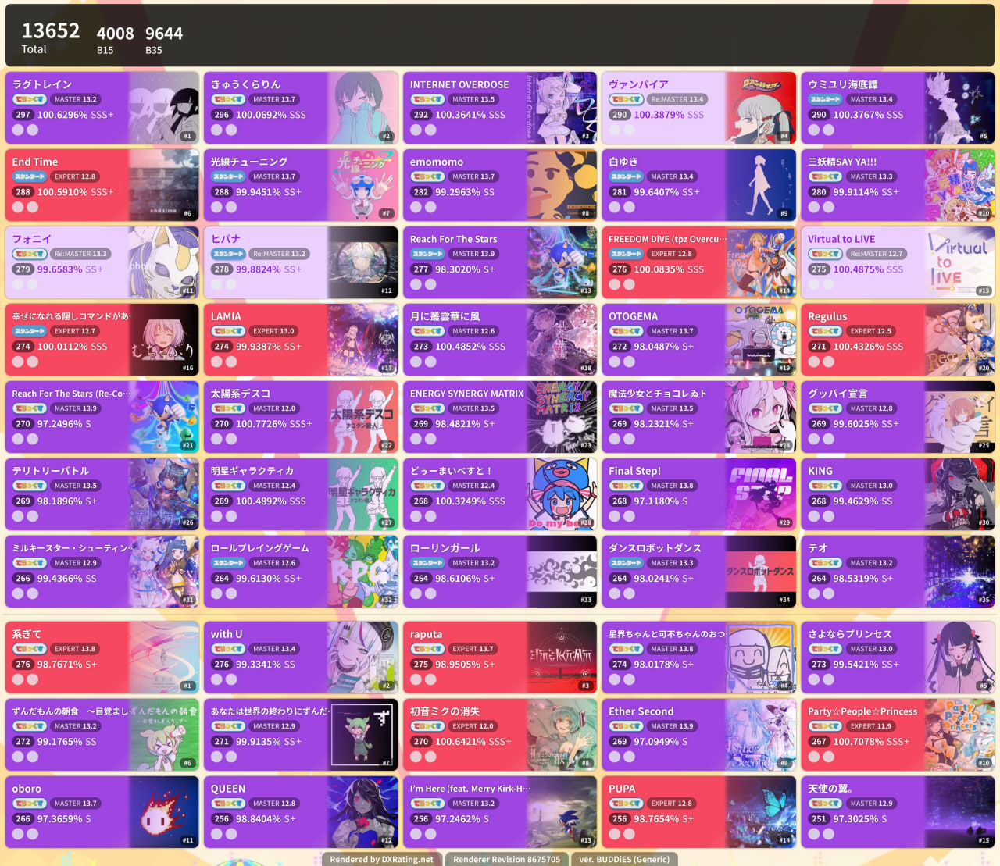
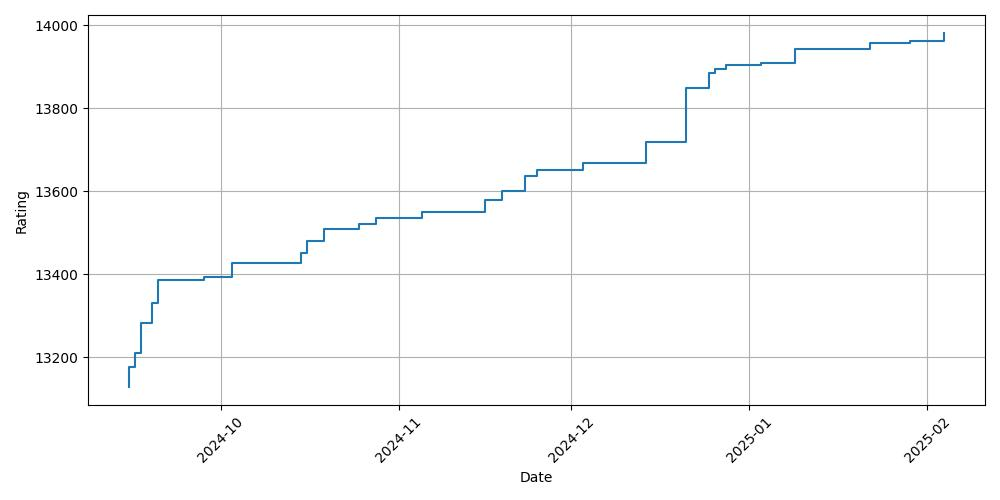
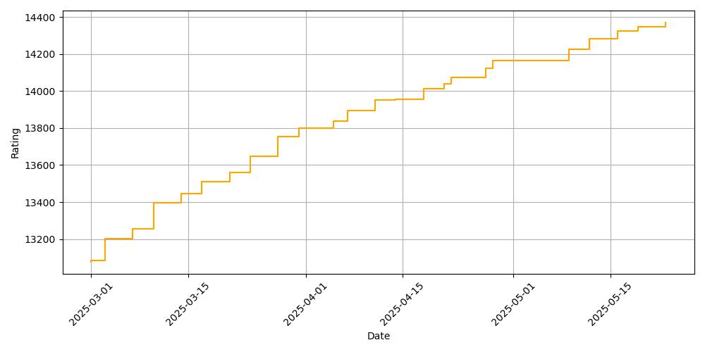

# maimai-scores

**WARNING: ALL CHARTS ARE FROM THE INTERNET AND NOT RELATED TO MAIMAI (SEGA).**

Here keeps all my maimai scores (unofficial) from AstroDX and official scores from maimai (CN ver.). See the progress here.

Use `history/graph.py` to draw history graphs (`matplotlib`, `numpy`, `tesseract`, `pillow`, `opencv-python`, `requests` required). 

## AstroDX

### Current Best 50

> Using maimai PRiSM (Generic)

### Rating Graph

## maimai (CN ver.)

### Current Best 50

### Rating Graph

## References

[DXRating.net](https://dxrating.net/rating)

[舞萌 DX | 中二节奏查分器（水鱼）](https://www.diving-fish.com/maimaidx/prober/)

[maimai DX 查分器（落雪）](https://maimai.lxns.net/)

[可怜 Bot](https://karenbot.xszq.xyz)
