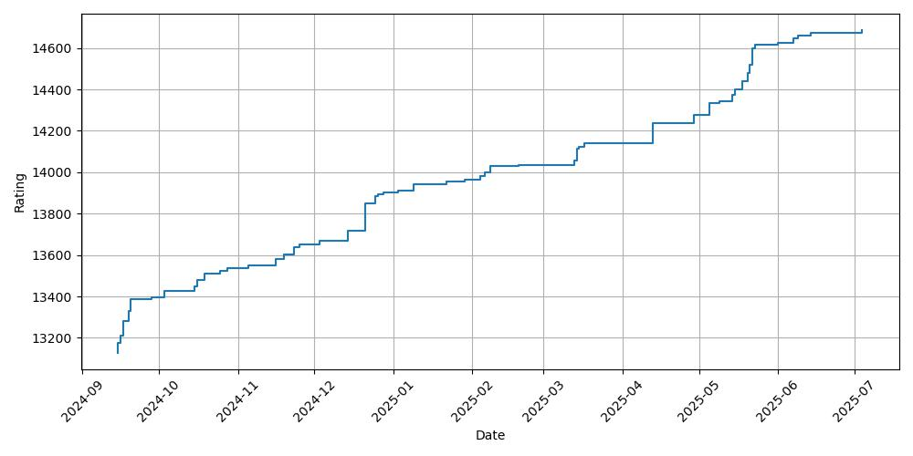
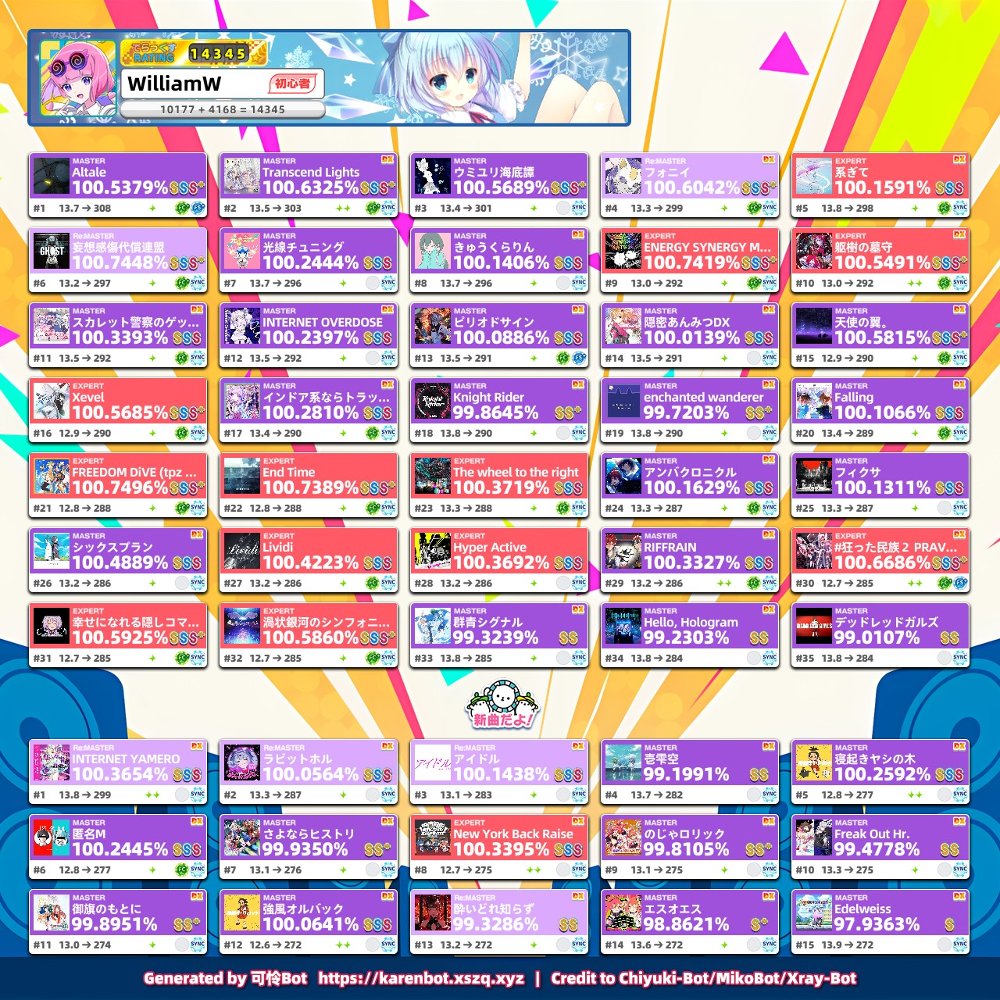
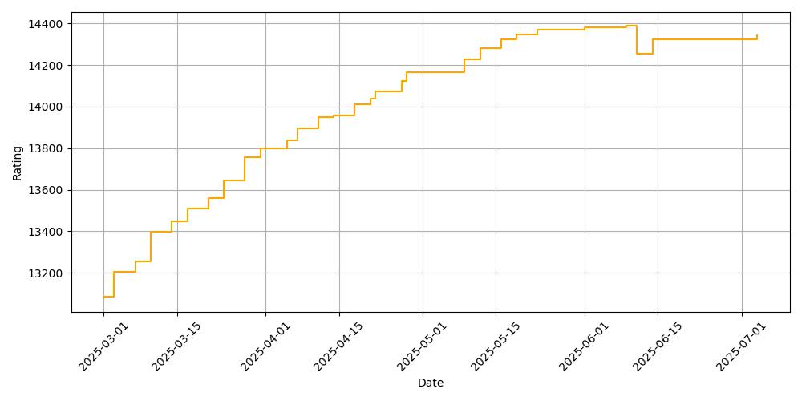

# maimai-scores

**WARNING: ALL CHARTS ARE FROM THE INTERNET AND NOT RELATED TO MAIMAI (SEGA).**

Here keeps all my maimai scores (unofficial) from AstroDX and official score from maimai (CN ver.). See the progress here.

Use `main.py` to add new scores.

## AstroDX

### Current Best 50

> Using maimai BUDDiES PLUS (Generic)

### Rating Graph

## maimai (CN ver.)

### Current Best 50

### Rating Graph

## References

[mai-tools Rating Calculator](https://myjian.github.io/mai-tools/rating-calculator/#ratingOutput)

[DXRating.net](https://dxrating.net/rating)

[maimai | arcade-songs](https://arcade-songs.zetaraku.dev/maimai/)

[舞萌 DX 查分器](https://www.diving-fish.com/maimaidx/prober/)

[可怜 Bot](https://karenbot.xszq.xyz)
